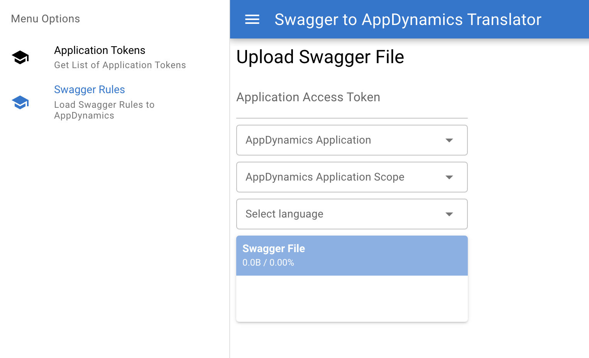

# Swagger Definition to AppDynamics Business Transaction Definition

## Purpose

This project is a tool to help define [Business Transaction Detection Rules](https://docs.appdynamics.com/appd/23.x/latest/en/application-monitoring/configure-instrumentation/transaction-detection-rules) based on [OpenAPI 2.0](https://swagger.io/specification/v2/) (aka Swagger) definition.

## How to use

At this time, it is intended as a service running on a Kubernetes cluster, however, it can be easily used in Docker or built as a command line tool.

To run in Kubernetes, there are 2 sample files in k8s directory

* [`cm-appd-swagger-config.yaml`](./k8s/cm-appd-swagger-config.yaml) is a ConfigMap definition - here are the definitions related to controller connectivity. Proxy is not supported at this time. Also, in this file you can set seeding string for simple authentication mechanism explained later.

* [`d-swagger-tool.yaml`](./k8s/d-swagger-tool.yaml) is a Deployment and Service definition of the service itself

After reviewing those files start the tool:

~~~~~~~~~~~~~~~~~~~~~~~~~~~~~~~~~~~~~~~~~~~~
kubectl apply -f cm-appd-swagger-config.yaml
kubectl apply -f d-swagger-tool.yaml
~~~~~~~~~~~~~~~~~~~~~~~~~~~~~~~~~~~~~~~~~~~~

now, connect to url exposed by the service, for example `http://localhost:8686/`

Simple GUI should load.



First field required is Application Access Token. This is a kind of safety belt, so that in an environment, where there are multiple application teams using this functionality, they do not unintentionally overwrite configuration of application of another team. By no means this is intended as a bullet proof security mechanism. 

There is a Admin Token which can be used to configure any application and to generate Access Tokens for individual applications. The Admin Token can be obtained by accessing a URL like  `http://localhost:8686/api/sec/token/0` and look for the "token" value.

Application Tokens can then be generated on the Application Tokens screen.

Once you know your token, Admin or Application token, select application, scope, language, and file with OpenAPI 2.0 API definition. The format expected at this time is YAML. Json support is in planning. 

The tool generates transaction detection rules based on the API definition. If it was uploaded previously, it makes necessary changes only to reflect current state of API definition.

## Running in Docker

Should there be a need to run the tool in Docker instead of Kubernetes, it can be started in a following way:

```
docker run --rm -it -p 8686:8686 \
-e APPDYNAMICS_AGENT_ACCOUNT_NAME=<appdynamics-controller-account-name> \
-e APPDYNAMICS_CONTROLLER_HOST_NAME=<appdynamics-controller-host> \
-e APPDYNAMICS_CONTROLLER_PORT=443 \
-e APPDYNAMICS_CONTROLLER_SSL_ENABLED=true \
-e APPDYNAMICS_API_KEY_NAME=<api-key-name> \
-e APPDYNAMICS_API_KEY_SECRET=<api-key-secret> \
<your-repository-where-the-image-was-uploaded>/swagger:latest
```

## Using the tools' API programatically

There can be a benefit in uploading the API definition programatically, for example as part of CI/CD pipeline. 

[`swagger-upload.sh`](./swagger-upload.sh) shows an example, how to do it. 

The REST API published by the tool provides following services:

* `GET /api/appd/apps`
  
  Returns a list of applications in a JSON document like: `[{”name”: <string>, “id”: <int>,…},…]`

* `GET /api/appd/app/:appId/scopes`
  
  Returns a list of scopes for an application `<appId>` in JSON document like `{“scopes”:[{“summary”: {“name”: <string>, “id”: <int>,…},…},…]}`

* `POST /api/swagger/upload/:appId/:scopeId/:langId/:token`
  
  Posts a content of a Swagger file for processing and upload to AppDynamics transaction detection rules for a given application and scope. Language ID must be provided in `<langId` parameter and `<token>` must be the correct Application Access Token for the application or the Admin Token. It can be used in a following way: `curl –F 'data=@/file/path/name.json' <url-for-POST-per-above>`


Language ID's are following:

| Language     | langId      |
|--------------|-------------|
| Java         | 0 |
| .NET         | 1 |
| NodeJS       | 2 |
| Python       | 3 |
| PHP          | 4 |
| Apache HTTPD | 5 |

### Some API call examples from Linux shell:

~~~
curl –s http://localhost:8686/api/appd/apps | jq -r '.[] | select(.name == "MD-Swagger") | .id'
Gets application appId for application "MD-Swagger"

curl –s http://localhost:8686/api/appd/app/9123/scopes | jq -r '.scopes[] | select(.summary.name == "Default Scope") | .summary.id'
Gets scopeId for application with appId = 9123 and the Default Scope
~~~

## Support

We welcome feedback, questions, issue reports and pull requests.

Maintainer's email address: mdivis@cisco.com
[GitHub Issues](https://github.com/chrlic/SwaggerAppDTool/issues)

## License

Copyright 2023 Cisco Systems, Inc.

Licensed under the Apache License, Version 2.0 (the "License"); you may not use this file except in compliance with the License.
You may obtain a copy of the License at

[http://www.apache.org/licenses/LICENSE-2.0](http://www.apache.org/licenses/LICENSE-2.0)

Unless required by applicable law or agreed to in writing, software distributed under the License is distributed on an
"AS IS" BASIS, WITHOUT WARRANTIES OR CONDITIONS OF ANY KIND, either express or implied.
See the License for the specific language governing permissions and limitations under the License. 